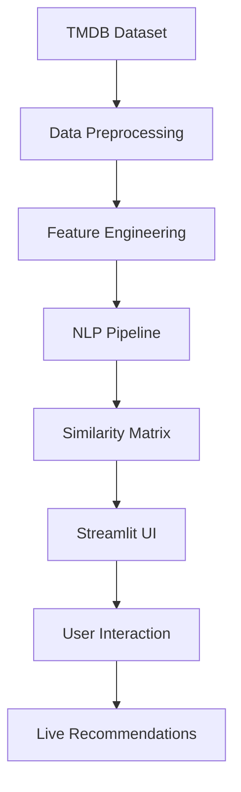

# 🎬 Movie Matrix 2.0 🌌

**A Cyberpunk-themed Movie Recommendation System**  
*Where Machine Learning Meets Cinematic Futurism*

## 🌟 Features

### 🤖 Core Engine
- **Content-Based Filtering** using movie metadata
- **NLP Processed** tags from genres, cast, crew, and overviews
- **Cosine Similarity** for recommendations
- **5000+ Movie Database** from TMDB
- **Porter Stemming** for text normalization

### 🖥 Streamlit UI
- **Cyberpunk Styling** with neon animations
- **Real-time TMDB Poster Integration**
- **Holographic Movie Cards**
- **Animated Loading Sequences**
- **Interactive Control Panel**
- **Responsive Layout**

## 🧠 System Architecture

